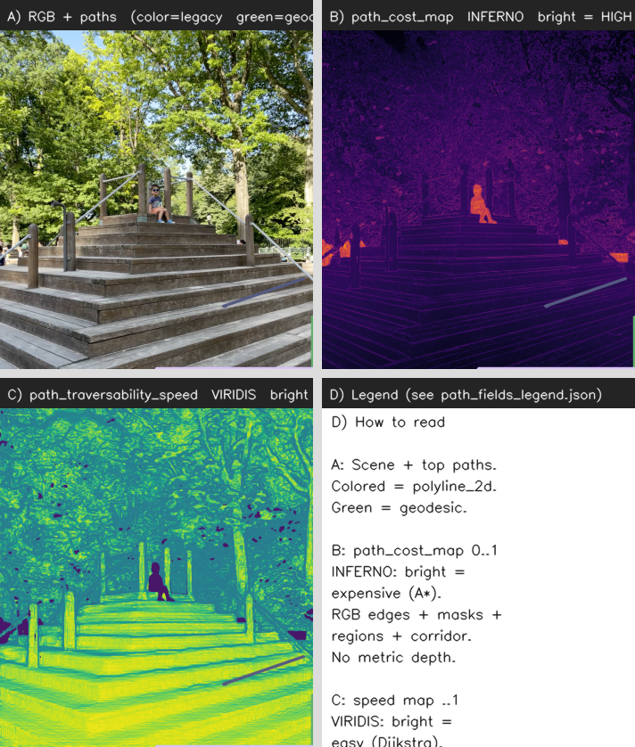
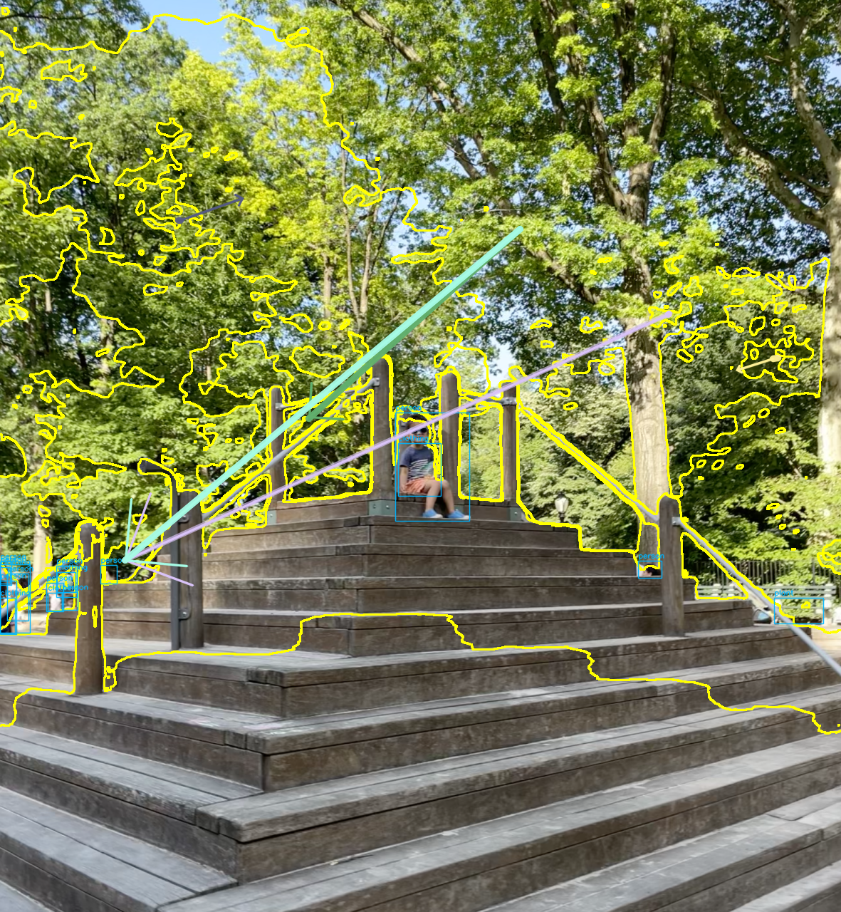
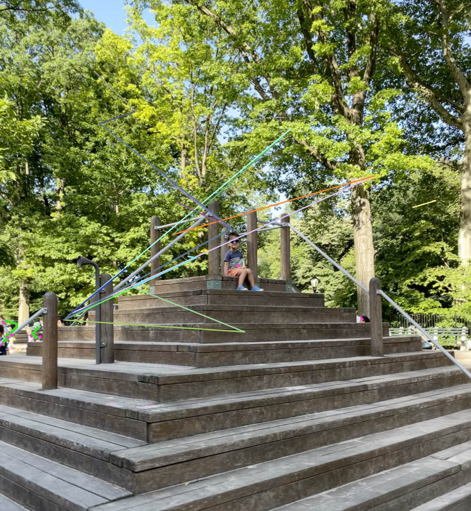
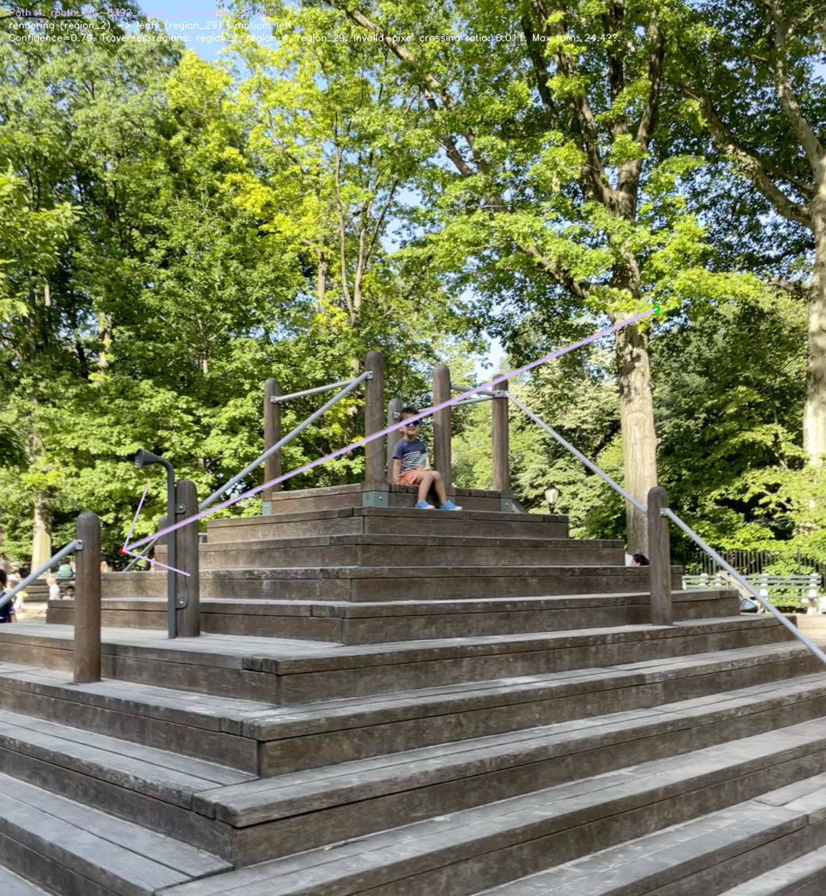
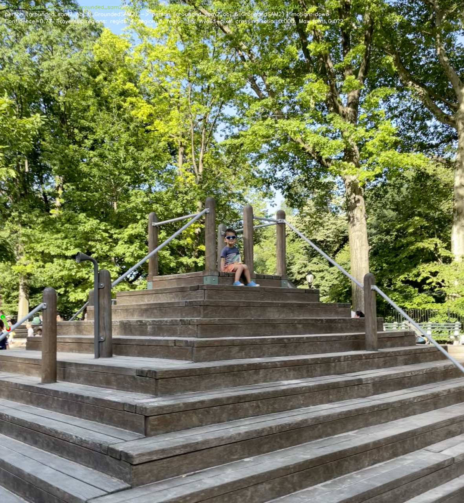

# CITV

RGB images → metric depth, instance masks, semantic labels, spatial relations, and optional **depth regions**, **path exports**, **animation artifacts**, and **captions** — computed locally (no paid APIs) after `setup.sh`.

> **Key docs** — read these alongside the code and `output_*` / `scene_graph/` trees:
>
> | Document | Role |
> | --- | --- |
> | [`NOTES.md`](NOTES.md) | Stage-by-stage technical reference grounded in `scene_understanding.py` and `depth.py`: full flow from undistortion through labelling, relations, serialization, visualization, formulas, output file layout, config, and reproduction. |
> | [`thoughts.md`](thoughts.md) | Working log and upgrade notes (e.g. region-aware flow: region JSON/overlays, object fields like `region_id` / region-relative 3D, relation gating `all` vs `intra_region_only`, caption/prompt parity); environment/debugging lessons and test status. |
> | [`docs/path_updates.md`](docs/path_updates.md) | Canonical **design** doc for path, trajectory, affordance, and action-manifold evolution: current staged pipeline vs root monolith strengths/gaps, pitfalls (“better shortest-path search is not enough”), richer motion contracts, and implementation roadmap. |
> | [`docs/SCENE_GRAPH_DEEP_DIVE.md`](docs/SCENE_GRAPH_DEEP_DIVE.md) | Scene-graph–focused analysis: hybrid GroundedSAM2 + SAM2 AMG segmentation, per-mask labelling chain, relation plumbing, and how **`{stem}_scene.json`** is assembled (tracks, top-level `relations`, regions, hierarchy); recommendations for hierarchy and labelling quality. |

**Summaries**

- **NOTES.md** — Treat as the formula-complete walkthrough of what each stage does and which files it touches.
- **thoughts.md** — Captures recent structural changes (regions threading through scene graph, relations, hierarchy) and practical caveats (disk, `python3`, Torch stack).
- **docs/path_updates.md** — Read before changing pathing or animation exports; it defines desired contracts (3D polylines, semantic traces, caption-as-evidence) beyond today’s slimmer staged exporter.
- **docs/SCENE_GRAPH_DEEP_DIVE.md** — Use when reasoning about **nodes vs masks**, merge behavior, and **what ends up in** `scene_graph/<track>/{stem}_scene.json` vs companion JSON; kept aligned with `scene_understanding.py` / `scene_understanding/pipeline.py` as the implementation evolves.

---

## Repository layout

| Path | Purpose |
| --- | --- |
| [`scene_understanding/`](scene_understanding/) | Package modules: [`stages/`](scene_understanding/stages/) (orchestration hooks including [`full_run.py`](scene_understanding/stages/full_run.py)), [`regions/`](scene_understanding/regions/), [`pathing/`](scene_understanding/pathing/), [`labeling/`](scene_understanding/labeling/), [`relations/`](scene_understanding/relations/), [`depth/`](scene_understanding/depth/), [`geometry/`](scene_understanding/geometry/), [`visualization/`](scene_understanding/visualization/), [`pipeline_context.py`](scene_understanding/pipeline_context.py) |
| [`scene_understanding.py`](scene_understanding.py) | Main pipeline body and legacy-equivalent processing; CLI / `__main__` delegates via [`scene_understanding/pipeline.py`](scene_understanding/pipeline.py) (`PreprocessConfig.scene_pipeline_mode`, `CITV_SCENE_PIPELINE_MODE`) |
| [`config.py`](config.py) | Central feature switches (segmentation tracks, regions, relations, paths, models, IO layout) |
| [`depth.py`](depth.py) | Depth estimation helpers coordinated with indoor/outdoor classification |
| [`tools/`](tools/) | Utilities such as [`calibrate_camera.py`](tools/calibrate_camera.py) |
| [`docs/`](docs/) | Additional design notes (e.g. segmentation, depth accuracy, labelling); **`path_updates.md`** for path/animation direction |
| `test_*.py`, `test/` | Local pytest modules and fixtures (gitignored; keep on your machine only) |

Outputs typically land under per-run directories (e.g. `scene_graph/<track>/`, staged subtrees, depth/visualization PNGs); exact filenames are documented in **NOTES.md** § output structure.

---

## Overview

CITV takes a directory of images and, for each image, produces a structured JSON scene graph describing:

- Every segmented object (mask, bounding box, 2D centroid, depth-weighted 3D coordinates)
- Metric depth statistics per object — with and without adaptive mask erosion for comparison
- Semantic labels from a per-mask priority chain (**GroundingDINO → Florence-2 → RAM++**), with **`_choose_mask_name_fields`** merging evidence into display/canonical names; RAM++ also feeds whole-image tags that shape the GDINO text query before segmentation when enabled
- Spatial and semantic relations between overlapping objects (Pix2SG + Florence-2)
- Optional lens-undistortion using a calibrated camera matrix

The pipeline runs entirely locally after a one-shot `setup.sh` and produces no calls to paid APIs.

---

## Pipeline Architecture

```
Input image
     │
     ▼
┌──────────────────────────────────────────────────────────────┐
│  Stage 0  Camera undistortion (optional)                     │
│           cv2.undistort() using calibration JSON             │
└────────────────────────┬─────────────────────────────────────┘
                         │
                         ▼
┌──────────────────────────────────────────────────────────────┐
│  Stage 1  Camera intrinsics                                  │
│           Priority: calibration file > explicit fx/fy > FOV  │
│           FOV fallback: fx = W / (2·tan(FOV·π/360))          │
└────────────────────────┬─────────────────────────────────────┘
                         │
                         ▼
┌──────────────────────────────────────────────────────────────┐
│  Stage 2  Metric depth estimation                            │
│           CLIP classifies scene → indoor/outdoor             │
│           Depth Anything V2 Metric → float32 metres          │
└────────────────────────┬─────────────────────────────────────┘
                         │
                         ▼
┌──────────────────────────────────────────────────────────────┐
│  Stage 3  Instance segmentation (dual-segmentor)             │
│           GroundingDINO → SAM2 per-bbox  (object-level)      │
│           SAM2 AMG grid-based            (part/small-object) │
│           IoU deduplication (threshold 0.7) → merged masks   │
└────────────────────────┬─────────────────────────────────────┘
                         │
                         ▼
┌──────────────────────────────────────────────────────────────┐
│  Stage 4  Per-mask depth analysis                            │
│           Adaptive erosion → sigma-clipping → histogram mode │
│           Back-projection → (X, Y, Z) in metres              │
│           Transparency detection via border-ring comparison  │
│           Dual erosion: stats stored with AND without erosion│
└────────────────────────┬─────────────────────────────────────┘
                         │
                         ▼
┌──────────────────────────────────────────────────────────────┐
│  Stage 5  Semantic labelling                                 │
│           GDINO label > Florence-2 crop > RAM++ crop         │
│           (+ evidence fusion for canonical / display names)  │
└────────────────────────┬─────────────────────────────────────┘
                         │
                         ▼
┌──────────────────────────────────────────────────────────────┐
│  Stage 6  Relation graph (Pix2SG + Florence-2)               │
│           Spatial scaffold for overlapping mask pairs        │
│           Florence-2 <CAPTION> over RED/BLUE overlay crops   │
│           Canonical predicate extraction                     │
└────────────────────────┬─────────────────────────────────────┘
                         │
                         ▼
              {stem}_scene.json
```

Orchestration lives in `scene_understanding` stages and `scene_understanding.py` / `scene_understanding.pipeline` (mode env: `CITV_SCENE_PIPELINE_MODE`; optional slim staged chain: `CITV_STAGED_MODULAR_CHAIN_ONLY`). **RAM++** can update the GroundingDINO text query from whole-image tags (`refresh_gdino_query_if_configured` in `scene_understanding/core/prompting.py`) before box prompts run. Optional **regions**, **paths**, **captions**, and **animation** exports extend this core chain — see **NOTES.md** for artifact lists and **docs/path_updates.md** for path/animation design intent.

## Setup

### Requirements

- Python 3.9–3.11
- CUDA-capable GPU (≥ 8 GB VRAM recommended)
- `nvcc` on PATH (`sudo apt install nvidia-cuda-toolkit`)
- ~20 GB free disk space

### One-shot install

```bash
git clone https://github.com/omondistanley/citv.git
cd citv
bash setup.sh
```

### Pipeline quick test

```bash
python scene_understanding.py --input_dir images --output_dir output_scene
```

Place image(s) in `images/` and inspect the scene JSON (commonly `output_scene/scene_graph/<track>/{stem}_scene.json`, depending on config and pipeline mode).

## Output Format

Each image produces `{stem}_scene.json`:

```json
{
  "image": "images/living_room.jpg",
  "scene_type": "indoor",
  "objects": [
    {
      "id": "obj_0",
      "label": "sofa",
      "conf": 0.87,
      "segmentor": "GroundedSAM2",
      "bbox": [120, 80, 540, 410],
      "mask_centroid_2d": [330, 245],
      "coordinates_3d": {"x": -0.42, "y": 0.15, "z": 2.31},
      "depth_stats": {
        "z_val": 2.31,
        "z_val_pixels": 2.31,
        "possibly_transparent": false,
        "depth_separation_from_background": 0.89
      },
      "depth_stats_no_erosion": { "z_val": 2.28, "..." : "..." },
      "coordinates_3d_no_erosion": {"x": -0.41, "y": 0.14, "z": 2.28},
      "grounded_sam2_label": "sofa",
      "grounded_sam2_confidence": 0.87
    }
  ],
  "relations": [
    {
      "subject": "obj_0",
      "predicate": "in front of",
      "object": "obj_2",
      "source_layer": "florence2"
    }
  ]
}
```

Every object carries **dual depth stats** — one set computed with adaptive mask erosion, one without — so you can compare the effect of erosion on depth accuracy.

Full runs usually include a **`metadata`** block on the scene JSON with relative paths into the path bundle (for example `path_hypotheses_json`, `animation_plan_json`, `path_visual_index_json`, `trajectory_hypotheses_json`) when those exports are enabled in `config.py`.

### Path hypotheses and matching animation / motion artifacts

When **`export_path_hypotheses`** is on, path-level outputs are written under:

`scene_graph/<track>/{stem}_paths/`

The machine-readable **paths** list lives in **`path_hypotheses.json`** (not a separate `paths.json` — use the `"paths"` array inside this file). Typical top-level fields include `schema_version`, `image_stem`, `track`, **`paths`**, `recommended_path_ids`, `suppressed_path_ids`, `rejections`, and `traversability` (speed-map paths and refinement flags).

Each hypothesis in **`paths`** is keyed by **`path_id`** and includes geometry and scoring, for example:

```json
{
  "path_id": "opath_IMG123_obj_0_to_obj_3_k01",
  "path_level": "object",
  "path_type": "object_to_object",
  "source_entity": {"type": "object", "id": "obj_0", "display_label": "obj_0"},
  "target_entity": {"type": "object", "id": "obj_3", "display_label": "obj_3"},
  "polyline_2d": [[120, 400], [180, 380], [260, 310]],
  "scores": {
    "overall_confidence": 0.72,
    "geometric_feasibility": 0.8,
    "semantic_plausibility": 0.55
  },
  "motion_metrics": {
    "motion_distance_px": 210.5,
    "trajectory_type": "traverse"
  }
}
```

**`animation_plan.json`** is derived from the same ranked hypotheses (top‑K by confidence when **`path_animation_enabled`** is true). It exposes a **`paths`** array whose entries reuse **`path_id`** / **`path_num`** and add time-based **actions**: `segments` (`motion`: e.g. `idle`, `walk`, `run`, `jump` with `t0_s` / `t1_s`), **`trajectory_points`** (aligned `polyline_2d`), **`timeline_records`**, **`fps`**, and **`duration_s`**.

```json
{
  "fps": 24,
  "paths": [
    {
      "path_id": "opath_IMG123_obj_0_to_obj_3_k01",
      "path_num": 3,
      "segments": [
        {"motion": "idle", "t0_s": 0.0, "t1_s": 0.5},
        {"motion": "walk", "t0_s": 0.5, "t1_s": 3.2}
      ],
      "trajectory_points": [[120, 400], [180, 380], [260, 310]],
      "timeline_records": [
        {"time_s": 0.0, "motion": "idle", "path_id": "opath_IMG123_obj_0_to_obj_3_k01"},
        {"time_s": 0.5, "motion": "walk", "path_id": "opath_IMG123_obj_0_to_obj_3_k01"}
      ],
      "duration_s": 3.2
    }
  ]
}
```

**`path_visual_index.json`** ties each **`path_id`** to rendered overlays (`per_path_image`), the shared **`animation_record`** URI (**`animation_plan.json`**), and optional diagnostics/description records.

Related motion exports in the same folder often include **`trajectory_hypotheses.json`**, **`insertion_path_ensembles.json`**, and **`motion_contracts_overlay.png`** when enabled — see **NOTES.md** / **`docs/path_updates.md`** for the fuller contract. Staged or extended bundles may also reference additional action summaries (for example **`action_hypotheses.json`**) from **`metadata`** or artifact manifests when that tier of export is present.


### Results walkthrough: input → path JSON → QA visualization

Use this section when reviewing a completed run or when adding screenshots/video to a PR. It is written against the checked-in **`IMG-6392`** sample artifacts, but the same shape applies to any input image stem.

#### 1) Input and stage flow

| Step | Artifact / field | What it proves |
| --- | --- | --- |
| Input frame | `images/IMG-6392.png` | Source RGB image that all depth, segmentation, path, and animation records are aligned to. |
| Scene graph | `mps/scene_graph/grounded_sam2/IMG-6392_scene.json` | Object, region, relation, depth, caption, and metadata anchor for the run. |
| Depth/regions | `mps/scene_graph/grounded_sam2/IMG-6392_depth_map.png`, `IMG-6392_regions.json`, `IMG-6392_regions_overlay.png` | Metric depth and region partitioning that feed feasible pixels and region-to-region routing. |
| Path workspace | `mps/scene_graph/grounded_sam2/IMG-6392_paths/` | Bundle root for path hypotheses, traversability maps, motion contracts, per-path images, and animation records. |
| Final path JSON | `mps/scene_graph/grounded_sam2/IMG-6392_paths/path_hypotheses.json` | The effective “paths.json”: inspect the top-level **`paths`** array, not a separate file named `paths.json`. |
| Motion contracts | `insertion_path_ensembles.json`, `trajectory_hypotheses.json`, `animation_plan.json` | Additive contracts used by downstream renderers: route families, instant-prior actor motion, and top-K timed path playback. |
| Visual index | `path_visual_index.json` | Lookup table from **`path_id`** to per-path image, description, diagnostics, and animation record. |

The design target in [`docs/path_updates.md`](docs/path_updates.md) is broader than shortest-path routing: a good animation contract can be a ribbon, blob, volume, contact patch, portal, occlusion pulse, or effect field. The current checked-in path bundle is the implemented, additive version of that idea: legacy-compatible **`polyline_2d`** paths remain available, while motion-contract files and QA overlays confirm whether the geometry, semantic evidence, traversability field, and animation timing agree.

```text
images/IMG-6392.png
  └─ scene_understanding.py / staged legacy-equivalent run
      ├─ depth + regions + objects + relations
      ├─ path_hypotheses.json              # ranked paths[] records
      ├─ insertion_path_ensembles.json     # route families / agent footprint contracts
      ├─ trajectory_hypotheses.json        # object instant-prior motion contracts
      ├─ animation_plan.json               # top-K timed route playback records
      ├─ path_visual_index.json            # path_id → image/json/md references
      └─ PNG/MP4 QA overlays               # human confirmation of JSON contracts
```

#### 2) What the final JSON contains today

For `IMG-6392`, the materialized `mps` bundle contains **31** ranked path hypotheses, **10** animation-plan paths, **31** insertion-path ensembles, and **8** trajectory hypotheses. A typical `path_hypotheses.json` record includes:

```json
{
  "path_id": "rpath_IMG-6392_region_11_to_region_21_k01",
  "path_num": 1,
  "path_level": "region",
  "path_type": "region_to_region",
  "source_entity": {"type": "region", "id": "region_11", "display_label": "rendering (region_11)"},
  "target_entity": {"type": "region", "id": "region_21", "display_label": "map (region_21)"},
  "regions_traversed": ["region_11", "region_21"],
  "polyline_2d": [[1085, 503], [1092, 502], [1035, 519]],
  "scores": {
    "overall_confidence": 0.795876097888519,
    "geometric_feasibility": 0.9576156088776948,
    "semantic_plausibility": 0.5
  },
  "motion_metrics": {
    "motion_distance_px": 66.55,
    "trajectory_type": "traverse"
  },
  "semantic_valid": true,
  "affordance_trace": [{"region": "region_11", "affordance": "interaction_zone"}]
}
```

Top-ranked examples in the current sample bundle show both region and object motion:

| Path # | Path id | Level | Review focus |
| ---: | --- | --- | --- |
| 1 | `rpath_IMG-6392_region_11_to_region_21_k01` | region | Short region-to-region traverse; easiest sanity check for `polyline_2d` and `animation_plan.json`. |
| 4 | `rpath_IMG-6392_region_2_to_region_29_k01` | region | Longer cross-image route; useful for traversability and region-contour validation. |
| 6 | `opath_IMG-6392_grounded_sam2_obj_8_GroundedSAM2_to_grounded_sam2_obj_6_GroundedSAM2_k01` | object | Person-to-person object route; confirms object anchors and motion-type scoring. |
| 8 | `opath_IMG-6392_grounded_sam2_obj_2_GroundedSAM2_to_grounded_sam2_obj_7_GroundedSAM2_k01` | object | Alternate object route; useful for approach/recede direction checks. |
| 10 | `rpath_IMG-6392_region_23_to_region_29_k02` | region | Region route through a different semantic area; useful for suppression/diagnostic review. |

#### 3) Five best images to include in reviews

These images show different evidence layers for the same input and should be the first five images in a results-oriented README, issue, or PR. They intentionally mix global field checks, top-ranked paths, motion contracts, and per-path object/region examples.

| # | Image | Why it is useful |
| ---: | --- | --- |
| 1 |  | Confirms the **input RGB**, legacy **cost map**, traversability **speed map**, and overlaid sample paths agree. |
| 2 |  | Shows the highest-ranked paths over the scene, with region contours and object boxes. |
| 3 |  | Validates motion contracts: legacy route lines, geodesic refinements, and trajectory instant-prior arrows. |
| 4 |  | Single long region route for checking endpoint anchors, path color, and traversed regions. |
| 5 |  | Single object-to-object route for checking object anchors and route plausibility around masks. |

#### 4) Five videos to include for animation QA

The checked-in `output_results` run contains MP4 animation QA panels. Use video links for GitHub/Markdown portability; if your renderer supports inline HTML, the same paths can be placed in `<video controls>` tags.

| # | Video | What to inspect |
| ---: | --- | --- |
| 1 | [`panel_00_paths_trajectories.mp4`](output_results/IMG-6392/scene_graph/staged/IMG-6392_paths/animation_qa_24/panel_00_paths_trajectories.mp4) | Baseline top-ranked path timing and marker motion. |
| 2 | [`panel_03_paths_trajectories.mp4`](output_results/IMG-6392/scene_graph/staged/IMG-6392_paths/animation_qa_24/panel_03_paths_trajectories.mp4) | Longer region traverse; confirms interpolation stays on the rendered route. |
| 3 | [`panel_05_paths_trajectories.mp4`](output_results/IMG-6392/scene_graph/staged/IMG-6392_paths/animation_qa_24/panel_05_paths_trajectories.mp4) | Object-route panel; checks source/target anchoring and object-level motion. |
| 4 | [`panel_07_paths_trajectories.mp4`](output_results/IMG-6392/scene_graph/staged/IMG-6392_paths/animation_qa_24/panel_07_paths_trajectories.mp4) | Alternate object-route direction; useful for approach/recede sanity checks. |
| 5 | [`panel_10_paths_trajectories.mp4`](output_results/IMG-6392/scene_graph/staged/IMG-6392_paths/animation_qa_24/panel_10_paths_trajectories.mp4) | Different region family; checks that lower-ranked accepted paths still match JSON geometry. |

#### 5) Review checklist

- **Input alignment:** Every overlay should line up with `images/IMG-6392.png`; mismatches usually mean a resized/cropped image slipped into one stage.
- **JSON/visual parity:** For each selected **`path_id`**, confirm `polyline_2d`, `path_num`, and source/target labels match `path_visual_index.json` and the corresponding per-path PNG.
- **Motion-contract parity:** Confirm `trajectory_hypotheses.json` and `insertion_path_ensembles.json` exist when `export_motion_contract_json` is enabled, and that `motion_contracts_overlay.png` draws both route and instant-prior evidence.
- **Animation parity:** Confirm `animation_plan.json` uses the same **`path_id`** / **`path_num`** as `path_hypotheses.json`, then inspect the five MP4 panels above for timing and route-following errors.
- **Docs parity:** When future exports add `polyline_3d`, semantic/support traces, visibility profiles, alpha profiles, or non-line manifolds, keep this README section and [`docs/path_updates.md`](docs/path_updates.md) in sync so the displayed result contract matches the actual final JSON.

---

## Model Stack

| Model | Role | Source |
|---|---|---|
| **CLIP ViT-B/32** | Indoor/outdoor scene classification | [Radford et al., 2021](https://arxiv.org/abs/2103.00020) |
| **Depth Anything V2 Metric** | Metric monocular depth (metres) | [Yang et al., 2024](https://arxiv.org/abs/2406.09414) |
| **GroundingDINO** | Open-vocabulary object detection | [Liu et al., 2023](https://arxiv.org/abs/2303.05499) |
| **SAM2** | Prompted + automatic mask generation | [Ravi et al., 2024](https://arxiv.org/abs/2408.00714) |
| **Florence-2** | Semantic labelling (`<OD>`) + relation captions | [Xiao et al., 2023](https://arxiv.org/abs/2311.06242) |
| **RAM++** | Whole-image tagging + mask crop labels; GDINO query refresh | [Recognize Anything++](https://arxiv.org/abs/2306.03514) (project uses repo checkpoint integration) |


Thanks for reading. Beyond the **Key docs** table above, explore `output_*` runs, `scene_graph/` trees, and the modules under `scene_understanding/`. Critics, suggestions and improvements are welcome.

Kwaheri!!!