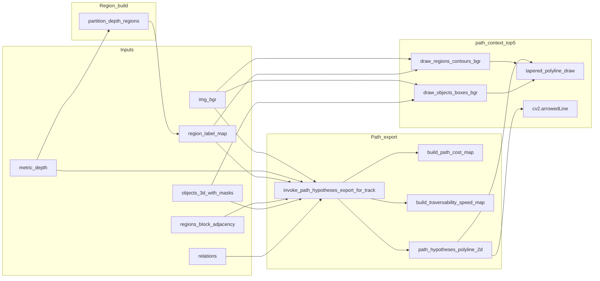

# Reviewer guide: `path_context_top5.png` pipeline and interpretation

This document explains how the composite image **`{stem}_paths/path_context_top5.png`** (for example `scene_graph/grounded_sam2/IMG_1117_paths/path_context_top5.png`) is produced, what each overlay means, and how it relates to depth, regions, and path hypotheses.

For **line-only** ranked path QA (no photograph underlay), **stable colors per `path_id`**, and the unified Markdown atlas, see **[trajs-upt.md](trajs-upt.md)** (`path_atlas_enabled` in `config.py`).

**Defaults:** [§8](#8-default-constants-appendix) cites [`scene_understanding/core/reviewer_config_defaults.py`](../scene_understanding/core/reviewer_config_defaults.py), which **mirrors** root [`config.py`](../config.py). When you change defaults, keep both in sync (or update only `config.py` and refresh the mirror).

---

## Accuracy guardrails (read first)

| Topic | Fact |
|--------|------|
| Box stroke color | BGR `(255, 180, 0)` |
| Layer encoding on this PNG | **`path_context_top5.png` does not** color boxes by `layer_type`. One color for every object bbox. |
| “Blue horizontal layer lines” | This composite **does not** draw depth-layer grid lines—only **region edges**, **bboxes**, **polylines**, and **`arrowedLine`**. Misreads often come from **bbox alignment**, **overlapping routes**, or confusion with **`*_layers.png`**. |
| Thick-to-thin motion cue | **Tapering** applies to the **`polyline_2d` ribbon** via [`tapered_polyline_draw`](../scene_understanding/pathing/path_canvas.py). The **OpenCV `arrowedLine`** uses **fixed thickness 2** and is a **chord** from first to last vertex—not a tapered shaft. |

---


---

## 1. Purpose 

**What this PNG is for:** One-glance **spatial QA** of the **top‑K** path hypotheses (by `scores.overall_confidence`) on the real photograph, with **region boundaries** and **object boxes** for context. When regions are depth-partitioned, yellow seams give a **coarse navigable layout**; named objects anchor **what** is in the scene, while **mask hierarchy** (off this PNG—see [§3](#3-region-perception--yellow-boundaries)) helps interpret **nesting** when routes pass through visually ambiguous overlap.

**What it is not:** A replacement for `path_hypotheses.json`, cost/speed maps, `layers.png`, the motion-contract overlay, or `{stem}_mask_hierarchy.png` / `{stem}_mask_hierarchy.json`.

### Source code — pipeline invocation

Path export runs **before** `_sam2_mask_array` is stripped from objects. The track loop calls [`invoke_path_hypotheses_export_for_track`](../scene_understanding/pathing/export_hook.py), which forwards to the legacy exporter on the pipeline instance.

```10:36:scene_understanding/pathing/export_hook.py
def invoke_path_hypotheses_export_for_track(
    pipeline: Any,
    *,
    img_bgr: np.ndarray,
    path_stem: str,
    track_dir_name: str,
    track_dir: Path,
    objects_3d_with_masks: List[Dict[str, Any]],
    regions_block: Optional[Dict[str, Any]],
    region_label_map: Optional[np.ndarray],
    region_adjacency: Optional[Dict[str, Any]],
    relations: List[Dict[str, Any]],
    metric_depth_m: Optional[np.ndarray] = None,
) -> Dict[str, str]:
    """Delegate to legacy pipeline method until full exporter body is moved here."""
    return pipeline._export_path_hypotheses_for_track(
        img_bgr=img_bgr,
        path_stem=path_stem,
        track_dir_name=track_dir_name,
        track_dir=track_dir,
        objects_3d_with_masks=objects_3d_with_masks,
        regions_block=regions_block,
        region_label_map=region_label_map,
        region_adjacency=region_adjacency,
        relations=relations,
        metric_depth_m=metric_depth_m,
    )
```

#### Walkthrough

- **Inputs:** `pipeline` (configured `SceneUnderstandingPipeline`), BGR image, stem and track paths, objects still carrying `_sam2_mask_array`, region graph inputs, relations, optional `metric_depth_m`.
- **Intermediate:** None inside the wrapper; arguments are forwarded unchanged.
- **Side effects:** None in this module; all disk writes happen inside `_export_path_hypotheses_for_track`.
- **Outputs:** `Dict[str, str]` of relative artifact paths merged into per-track metadata when non-empty.

---

## 2. End-to-end data flow (inputs → PNG)

**Inputs (per track):**

- **`img_bgr`:** BGR frame; canvas for all draws.
- **`metric_depth`:** Dense H×W depth (meters); drives region partition when enabled and feeds traversability / motion metrics.
- **`region_label_map` (`lm`):** int32 per-pixel region id (`0` = void).
- **`regions_block` / `region_adjacency`:** Region metadata and adjacency graph for routing.
- **`objects_3d_with_masks`:** Bboxes, `_sam2_mask_array`, centroids, names, `region_id`, etc.
- **`relations`:** Used for pair proposals and scoring signals.




### Source code —  region partition

```13:48:scene_understanding/stages/regions.py
def run(pipeline: Any, ctx: PipelineContext) -> PipelineContext:
    """Optional depth K-means + CC regions (writes label map + PNG under depth/)."""
    cfg = getattr(pipeline, "config", None)
    if not bool(getattr(cfg, "regions_enabled", False)) if cfg else False:
        return ctx
    if ctx.metric_depth is None:
        return ctx
    try:
        from ..regions.partitioner import label_map_to_bgr, partition_depth_regions
    except Exception as e:
        print(f"  [Regions] skipped (import failed): {e}")
        return ctx

    depth_dir = ctx.extra["depth_dir"]
    _dm = str(getattr(pipeline.depth_estimator, "backend_name", "DepthAnythingV2"))
    _k = int(getattr(cfg, "regions_k", 4)) if cfg else 4
    _min_px = int(getattr(cfg, "regions_min_region_px", 500)) if cfg else 500
    _blur = float(getattr(cfg, "regions_blur_sigma", 0.0)) if cfg else 0.0
    _seed = int(getattr(cfg, "regions_seed", 42)) if cfg else 42
    _part = partition_depth_regions(
        ctx.metric_depth,
        k=_k,
        min_region_px=_min_px,
        blur_sigma=_blur,
        seed=_seed,
        depth_model_id=_dm,
    )
    ctx.region_label_map = _part.label_map
    ctx.region_partition_meta = list(_part.regions)
    _bgr = label_map_to_bgr(_part.label_map, _part.palette)
    rpng = depth_dir / f"{ctx.stem}_regions.png"
    cv2.imwrite(str(rpng), _bgr)
    np.save(str(depth_dir / f"{ctx.stem}_regions_label_map.npy"), _part.label_map.astype(np.int32))
    ctx.extra["regions_png"] = str(rpng)
    print(f"  [Regions] partitioned into {len(ctx.region_partition_meta)} regions → {rpng.name}")
    return ctx
```

#### Walkthrough

- **Inputs:** `pipeline` and `ctx` with `metric_depth` and `depth_dir` in `ctx.extra`.
- **Intermediate:** `RegionPartitionResult` from `partition_depth_regions`; BGR preview via `label_map_to_bgr`.
- **Side effects:** Writes `{stem}_regions.png` and `.npy`; updates `ctx` region fields; prints log line.
- **Outputs:** Mutated `ctx` for downstream stages and for the legacy exporter that consumes `region_label_map`.

### Source code — 1D K-means on depth samples

```22:56:scene_understanding/regions/partitioner.py
def _kmeans_1d(
    samples: np.ndarray,
    k: int,
    rng: np.random.Generator,
    max_iter: int = 30,
) -> Tuple[np.ndarray, np.ndarray]:
    """Return (labels N, centroids k) for 1D samples."""
    x = samples.astype(np.float64).ravel()
    n = x.size
    if n < k:
        k = max(1, n)
    if k <= 1:
        return np.zeros(n, dtype=np.int32), np.array([float(np.mean(x))] if n else [0.0])

    # Init centroids via percentiles + tiny jitter for stability
    qs = np.linspace(0, 1, k + 2)[1:-1]
    centroids = np.quantile(x, qs).astype(np.float64)
    noise = rng.normal(0, 1e-4, size=k)
    centroids = centroids + noise

    labels = np.zeros(n, dtype=np.int32)
    for _ in range(max_iter):
        dist = np.abs(x[:, None] - centroids[None, :])
        new_labels = np.argmin(dist, axis=1).astype(np.int32)
        if np.array_equal(new_labels, labels):
            break
        labels = new_labels
        for j in range(k):
            mask_j = labels == j
            if mask_j.any():
                centroids[j] = float(np.mean(x[mask_j]))
            else:
                centroids[j] = float(np.median(x))

    return labels, centroids
```

#### Walkthrough

- **Inputs:** 1D depth samples `x`, cluster count `k`, RNG, iteration cap.
- **Intermediate:** `labels` per sample, `centroids` per cluster; distance matrix `dist` each iteration.
- **Side effects:** None (pure numpy).
- **Outputs:** Cluster labels and centroid depths for `partition_depth_regions`.

### Source code — `partition_depth_regions` (K-means + connected components)

```92:202:scene_understanding/regions/partitioner.py
def partition_depth_regions(
    metric_depth: np.ndarray,
    k: int = 4,
    min_region_px: int = 500,
    blur_sigma: float = 0.0,
    seed: int = 42,
    depth_model_id: str = "unknown",
) -> RegionPartitionResult:
    """
    Cluster valid depth pixels with 1D K-means, then split each cluster by connected components.
    Small components are merged to void (0).
    """
    depth = np.asarray(metric_depth, dtype=np.float32)
    h, w = depth.shape[:2]
    valid = np.isfinite(depth) & (depth > 1e-6)
    if blur_sigma and blur_sigma > 0:
        d_work = depth.copy()
        d_work[~valid] = 0
        blurred = cv2.GaussianBlur(d_work, (0, 0), float(blur_sigma))
        depth_use = np.where(valid, blurred, depth)
    else:
        depth_use = depth

    rng = np.random.default_rng(int(seed))
    cluster_map = np.zeros((h, w), dtype=np.int32)  # 0..k-1 cluster id per pixel; 0 also used for invalid

    if valid.sum() < max(k * 10, 50):
        return RegionPartitionResult(
            label_map=np.zeros((h, w), dtype=np.int32),
            regions=[],
            palette=[[0, 0, 0]],
            depth_model_id=depth_model_id,
        )

    vals = depth_use[valid]
    labels_flat, _centroids = _kmeans_1d(vals, k, rng)
    cluster_map_flat = np.zeros(h * w, dtype=np.int32)
    cluster_map_flat[valid.ravel()] = labels_flat + 1  # 1..k for valid (cluster id)

    cluster_2d = cluster_map_flat.reshape(h, w)
    # cluster_2d is 0 invalid, 1..k for valid pixels' cluster

    next_region = 1
    label_map = np.zeros((h, w), dtype=np.int32)
    regions_meta: List[Dict[str, Any]] = []

    global_valid_depths = depth[valid]
    q1, q2 = np.quantile(global_valid_depths, [1.0 / 3.0, 2.0 / 3.0]) if global_valid_depths.size else (0.0, 0.0)

    for c in range(1, k + 1):
        bin_mask = (cluster_2d == c).astype(np.uint8)
        if bin_mask.sum() == 0:
            continue
        num_cc, cc_labels = cv2.connectedComponents(bin_mask)
        for comp in range(1, num_cc):
            comp_mask = (cc_labels == comp) & (cluster_2d == c)
            area = int(comp_mask.sum())
            if area < min_region_px:
                continue
            rid = next_region
            next_region += 1
            label_map[comp_mask] = rid
            zs = depth[comp_mask]
            zs = zs[np.isfinite(zs)]
            if zs.size == 0:
                continue
            ys, xs = np.where(comp_mask)
            mean_z = float(np.mean(zs))
            if mean_z <= q1:
                rtype = "foreground"
            elif mean_z <= q2:
                rtype = "midground"
            else:
                rtype = "background"

            regions_meta.append(
                {
                    "region_index": rid,
                    "id": f"region_{rid}",
                    "type": rtype,
                    "depth_cluster": c - 1,
                    "depth_band_m": [round(float(np.min(zs)), 4), round(float(np.max(zs)), 4)],
                    "bbox_px": [
                        int(xs.min()),
                        int(ys.min()),
                        int(xs.max()),
                        int(ys.max()),
                    ],
                    "area_px": area,
                    "centroid_2d_px": [round(float(xs.mean()), 2), round(float(ys.mean()), 2)],
                    "depth_stats": {
                        "min": round(float(np.min(zs)), 4),
                        "max": round(float(np.max(zs)), 4),
                        "mean": round(float(np.mean(zs)), 4),
                        "std": round(float(np.std(zs)), 4) if zs.size > 1 else 0.0,
                        "mode": round(float(np.median(zs)), 4),
                    },
                    "object_ids": [],
                }
            )

    n_reg = len(regions_meta)
    max_idx = int(label_map.max()) if n_reg else 0
    palette = _make_palette(max_idx) if max_idx > 0 else [[0, 0, 0]]
    pal = palette
    return RegionPartitionResult(
        label_map=label_map,
        regions=regions_meta,
        palette=pal,
        depth_model_id=depth_model_id,
    )
```

#### Walkthrough

- **Inputs:** `metric_depth` H×W meters, `k`, `min_region_px`, optional Gaussian `blur_sigma`, RNG `seed`, `depth_model_id` string for metadata.
- **Intermediate:** Valid mask, optional blurred depth, 1D K-means labels reshaped to `cluster_2d`, CC per cluster, per-region stats and `regions_meta` rows, BGR `palette`.
- **Side effects:** None until the caller writes PNG/NPY (e.g. [`stages/regions.py`](../scene_understanding/stages/regions.py) or the legacy pipeline).
- **Outputs:** `RegionPartitionResult` (`label_map`, `regions`, `palette`) consumed for yellow boundaries and routing.

### Source code — traversability (per-pixel, depth + region + image)

```18:70:scene_understanding/pathing/traversability.py
def build_traversability_speed_map(
    metric_depth_m: Optional[np.ndarray],
    region_label_map: np.ndarray,
    obstacle_mask: np.ndarray,
    img_bgr: np.ndarray,
    cfg: Any,
) -> Tuple[np.ndarray, Dict[str, Any]]:
    """
    High speed = easy traversal. Combines:
    - feasible support (region label > 0),
    - depth-gradient flatness (metric ground proxy),
    - weak inverse of image edges (avoid cutting strong discontinuities).
    """
    lm = np.asarray(region_label_map, dtype=np.int32)
    obs = np.asarray(obstacle_mask, dtype=bool)
    h, w = lm.shape[:2]
    feasible = (lm > 0) & (~obs)

    gray = cv2.cvtColor(np.asarray(img_bgr), cv2.COLOR_BGR2GRAY)
    gx = cv2.Sobel(gray, cv2.CV_32F, 1, 0, ksize=3)
    gy = cv2.Sobel(gray, cv2.CV_32F, 0, 1, ksize=3)
    grad = cv2.magnitude(gx, gy)
    gmax = float(np.max(grad))
    edge_norm = (grad / gmax) if gmax > 1e-6 else np.zeros_like(grad, dtype=np.float32)
    w_edge = float(getattr(cfg, "trav_weight_image_edge", 0.25)) if cfg else 0.25
    smooth = np.clip(1.0 - w_edge * edge_norm, 0.0, 1.0).astype(np.float32)

    flat = np.ones((h, w), dtype=np.float32)
    if metric_depth_m is not None:
        dm = np.asarray(metric_depth_m, dtype=np.float32)
        finite = np.isfinite(dm) & (dm > 1e-6)
        if finite.any():
            gx_d = cv2.Sobel(dm, cv2.CV_32F, 1, 0, ksize=3)
            gy_d = cv2.Sobel(dm, cv2.CV_32F, 0, 1, ksize=3)
            gmd = cv2.magnitude(gx_d, gy_d)
            gmd = np.where(finite, gmd, 0.0)
            med = float(np.percentile(gmd[finite], 50.0))
            sigma = float(getattr(cfg, "trav_depth_grad_sigma_m", 0.35)) if cfg else 0.35
            flat = np.exp(-gmd / max(med, sigma)).astype(np.float32)
            flat = np.where(finite, flat, 0.15)

    w_flat = float(getattr(cfg, "trav_weight_depth_flatness", 0.55)) if cfg else 0.55
    w_smooth = float(getattr(cfg, "trav_weight_image_smooth", 0.45)) if cfg else 0.45
    ws = max(1e-6, w_flat + w_smooth)
    w_flat, w_smooth = w_flat / ws, w_smooth / ws
    speed = (w_flat * flat + w_smooth * smooth) * feasible.astype(np.float32)
    s_min = float(getattr(cfg, "trav_speed_floor", 0.06)) if cfg else 0.06
    speed = np.clip(speed, s_min, 1.0).astype(np.float32)
    meta = {
        "feasible_ratio": float(feasible.mean()) if feasible.size else 0.0,
        "speed_mean": float(np.mean(speed[feasible])) if feasible.any() else 0.0,
    }
    return speed, meta
```

#### Walkthrough

- **Inputs:** Optional `metric_depth_m`, `region_label_map`, boolean `obstacle_mask`, BGR `img_bgr`, `cfg` traversability weights.
- **Intermediate:** `feasible` mask, grayscale Sobel `edge_norm`, depth-gradient flatness `flat`, weighted `speed` in (0,1].
- **Side effects:** None in this function; caller may write NPY/PNG.
- **Outputs:** `speed` H×W float32 and small `meta` dict (feasible ratio, mean speed on feasible).

### Source code — per-pixel cost map for A*

```23:57:scene_understanding/pathing/cost_map.py
def build_path_cost_map(
    img_bgr: np.ndarray,
    region_label_map: np.ndarray,
    obstacle_mask: np.ndarray,
    cfg: Any,
) -> np.ndarray:
    gray = cv2.cvtColor(img_bgr, cv2.COLOR_BGR2GRAY)
    gx = cv2.Sobel(gray, cv2.CV_32F, 1, 0, ksize=3)
    gy = cv2.Sobel(gray, cv2.CV_32F, 0, 1, ksize=3)
    grad = cv2.magnitude(gx, gy)
    gmax = float(np.max(grad))
    edge_cost = (grad / gmax) if gmax > 1e-6 else np.zeros_like(grad, dtype=np.float32)

    obs = np.asarray(obstacle_mask).astype(np.uint8)
    obs_cost = cv2.GaussianBlur(obs.astype(np.float32), (0, 0), 1.5)
    if np.max(obs_cost) > 1e-6:
        obs_cost = obs_cost / float(np.max(obs_cost))

    lm = np.asarray(region_label_map, dtype=np.int32)
    region_prior = (lm <= 0).astype(np.float32)
    if np.max(region_prior) > 1e-6:
        region_prior = region_prior / float(np.max(region_prior))

    center_bonus = distance_transform_centering((~obs.astype(bool)))
    center_cost = 1.0 - center_bonus

    we = float(getattr(cfg, "path_cost_weight_edges", 0.35)) if cfg else 0.35
    wo = float(getattr(cfg, "path_cost_weight_obstacle", 0.35)) if cfg else 0.35
    wr = float(getattr(cfg, "path_cost_weight_region_prior", 0.15)) if cfg else 0.15
    wc = float(getattr(cfg, "path_cost_weight_centering", 0.15)) if cfg else 0.15
    ws = max(1e-6, we + wo + wr + wc)
    we, wo, wr, wc = we / ws, wo / ws, wr / ws, wc / ws
    cm = (we * edge_cost) + (wo * obs_cost) + (wr * region_prior) + (wc * center_cost)
    cm = np.clip(cm, 0.0, 1.0).astype(np.float32)
    return cm
```

#### Walkthrough

- **Inputs:** BGR scene, `region_label_map`, union `obstacle_mask`, `cfg` cost weights.
- **Intermediate:** Sobel edge norm, blurred obstacle cost, void-region prior, normalized distance-transform centering term, weighted sum `cm`.
- **Side effects:** None; exporter saves `path_cost_map` separately.
- **Outputs:** H×W float32 cost map in [0,1] for [`astar_on_cost_map`](../scene_understanding/pathing/cost_map.py).

### Source code — path export workspace (directories + feasible mask)

The full `_export_path_hypotheses_for_track` body still lives in the legacy monolith; the **first** slice (guard + mkdirs + `lm` / `feasible`) is mirrored here for documentation.

```10:61:scene_understanding/pathing/export_workspace.py
def prepare_path_hypotheses_workspace(
    cfg: Any,
    img_bgr: np.ndarray,
    path_stem: str,
    track_dir: Path,
    region_label_map: Optional[np.ndarray],
    regions_block: Optional[Dict[str, Any]],
    region_adjacency: Optional[Dict[str, Any]],
) -> Optional[Dict[str, Any]]:
    """
    Return workspace dict if export should proceed; ``None`` if disabled or missing regions.

    Keys: ``paths_root_dir``, ``images_root_dir``, ``images_region_dir``, ``images_object_dir``,
    ``images_mask_dir``, ``h``, ``w``, ``lm``, ``regions_meta``, ``region_by_id``, ``feasible``.
    """
    enabled = bool(getattr(cfg, "export_path_hypotheses", True)) if cfg else True
    if not enabled:
        return None
    if region_label_map is None or not regions_block or not region_adjacency:
        return None

    paths_root_dir = track_dir / f"{path_stem}_paths"
    paths_root_dir.mkdir(parents=True, exist_ok=True)
    images_root_dir = paths_root_dir / "images"
    images_root_dir.mkdir(parents=True, exist_ok=True)

    images_region_dir = images_root_dir / "region"
    images_object_dir = images_root_dir / "object"
    images_mask_dir = images_root_dir / "mask"
    images_region_dir.mkdir(parents=True, exist_ok=True)
    images_object_dir.mkdir(parents=True, exist_ok=True)
    images_mask_dir.mkdir(parents=True, exist_ok=True)

    h, w = img_bgr.shape[:2]
    lm = np.asarray(region_label_map, dtype=np.int32)
    regions_meta = list((regions_block or {}).get("regions", []) or [])
    region_by_id = {str(r.get("id", "")): r for r in regions_meta if str(r.get("id", "")).strip()}
    feasible = lm > 0

    return {
        "paths_root_dir": paths_root_dir,
        "images_root_dir": images_root_dir,
        "images_region_dir": images_region_dir,
        "images_object_dir": images_object_dir,
        "images_mask_dir": images_mask_dir,
        "h": h,
        "w": w,
        "lm": lm,
        "regions_meta": regions_meta,
        "region_by_id": region_by_id,
        "feasible": feasible,
    }
```

#### Walkthrough

- **Inputs:** `cfg`, `img_bgr`, `path_stem`, `track_dir`, `region_label_map`, `regions_block`, `region_adjacency`.
- **Intermediate:** Derived `paths_root_dir` tree under `{stem}_paths/images/{region,object,mask}`; `lm`, `regions_meta`, `region_by_id`, boolean `feasible` (`lm > 0`).
- **Side effects:** Creates directories on disk when returning non-`None`.
- **Outputs:** Workspace dict unpacked by the exporter, or `None` to skip path export early.

The legacy monolith still calls `partition_depth_regions` with the same parameters when `regions_enabled`; that call path is equivalent to the staged [`run` in `stages/regions.py`](../scene_understanding/stages/regions.py) (see the `partition_depth_regions` fence above).

---

## 3. Region perception — yellow boundaries

### Where `metric_depth` and `region_label_map` come from (before yellow)

Yellow is drawn from **`region_label_map` only**; depth enters **earlier** in the pipeline when that label map is built.

1. **Depth stage** — `ctx.img_rgb` is passed to [`DepthCoordinator.load_or_infer_depth`](../scene_understanding/depth/coordinator.py), which returns a dense **metric depth** map (meters) stored as `ctx.metric_depth` and persisted under `depth/` (see coordinator for the exact `.npy` naming).
2. **Regions stage (when `regions_enabled`)** — [`partition_depth_regions`](../scene_understanding/regions/partitioner.py) clusters valid depth pixels (1D K-means), splits by connected components, and assigns **integer region ids** per pixel; [`stages/regions.run`](../scene_understanding/stages/regions.py) copies the result to `ctx.region_label_map` and writes `{stem}_regions.png` / `{stem}_regions_label_map.npy`. The full partition walkthrough is already under [§2](#2-end-to-end-data-flow-inputs--png) above.
3. **Composite** — [`write_path_context_top5_png`](../scene_understanding/pathing/path_canvas.py) passes that same `lm` into `draw_regions_contours_bgr`. The yellow stroke is **label discontinuities**, not a direct colormap of depth.

```10:21:scene_understanding/stages/depth.py
def run(pipeline: Any, ctx: PipelineContext) -> PipelineContext:
    """Infer/reuse metric depth via DepthCoordinator."""
    depth_dir = ctx.extra["depth_dir"]
    reuse_existing = bool(getattr(pipeline, "_reuse_cached_depth", True))
    metric_depth = pipeline.depth_coordinator.load_or_infer_depth(
        image_rgb=ctx.img_rgb,
        output_dir=depth_dir,
        image_stem=ctx.stem,
        reuse_existing=reuse_existing,
    )
    ctx.metric_depth = metric_depth
    return ctx
```

```24:56:scene_understanding/depth/coordinator.py
    def load_or_infer_depth(
        self,
        image_rgb: np.ndarray,
        output_dir: Path,
        image_stem: str,
        reuse_existing: bool = False,
    ) -> np.ndarray:
        """Load a saved metric depth map when requested, otherwise infer and save one."""
        output_dir.mkdir(parents=True, exist_ok=True)
        depth_npy = output_dir / f"{image_stem}_depth_metric.npy"
        height, width = image_rgb.shape[:2]

        if reuse_existing and depth_npy.exists():
            metric_depth = np.load(str(depth_npy)).astype(np.float32)
            if metric_depth.shape[:2] != (height, width):
                metric_depth = cv2.resize(
                    metric_depth,
                    (width, height),
                    interpolation=cv2.INTER_NEAREST,
                )
            return metric_depth

        backend = getattr(self.depth_estimator, "backend", None)
        if backend is None:
            raise RuntimeError(
                "Depth backend is unavailable and no reusable saved depth map was found."
            )

        raw_depth = backend.infer(image_rgb)
        depth_full = cv2.resize(raw_depth, (width, height), interpolation=cv2.INTER_NEAREST)
        metric_depth = depth_full.astype(np.float32) * self.depth_scale_factor
        np.save(depth_npy, metric_depth)
        return metric_depth
```

**Display note:** OpenCV uses BGR; `(0, 255, 255)` is the **cyan channel triplet** that reads as **yellow** on typical RGB-oriented monitors—see [§8E](#8e-path_context_top5-render-only).

### Depth regions vs region routing vs mask hierarchy

| Concept | On `path_context_top5.png`? | Role |
|--------|-----------------------------|------|
| **`region_label_map` (`lm`)** from depth partition | **Yes** — yellow seams | Per-pixel region id; discontinuities are drawn in the [yellow overlay](#source-code--yellow-overlay) subsection below. |
| **`regions_block` / `region_adjacency`** | **No** (JSON sidecars) | **Region-to-region routing** for top‑K paths and export guards; required together for workspace prep in [`prepare_path_hypotheses_workspace`](../scene_understanding/pathing/export_workspace.py). They do **not** change how yellow pixels are chosen. |
| **Mask containment hierarchy** | **No** | Parent/child edges from **mask overlap** (SAM2 entities + synthetic region rows). Serialized as `scene_graph/{track}/{stem}_mask_hierarchy.json` and visualized as `{stem}_mask_hierarchy.png` (plus `{stem}_region_hierarchy.png` when the pipeline writes the region-only diagram). Use them to QA **part-of / inside** structure, not polylines on this composite. |

Core overlap logic (containment thresholds and optional region–region edges) lives in [`build_mask_hierarchy`](../scene_understanding/regions/mask_hierarchy.py):

```17:119:scene_understanding/regions/mask_hierarchy.py
def build_mask_hierarchy(
    objects_3d: List[Dict[str, Any]],
    *,
    hierarchy_enable_region_region_edges: bool = False,
    hierarchy_region_region_containment_min: float = 0.97,
) -> Dict[str, Any]:
    edges: List[Dict[str, Any]] = []
    parent_for: Dict[str, str] = {}
    child_lists: Dict[str, List[str]] = {}
    edge_scores: Dict[Tuple[str, str], float] = {}

    for child in objects_3d:
        child_mask = child.get("_sam2_mask_array")
        child_area = mask_area(child_mask)
        if child_area <= 0:
            continue

        best_parent = None
        best_score = 0.0
        best_edge: Optional[Dict[str, Any]] = None
        child_id = str(child.get("id"))

        for parent in objects_3d:
            parent_id = str(parent.get("id"))
            if parent_id == child_id:
                continue
            parent_mask = parent.get("_sam2_mask_array")
            parent_area = mask_area(parent_mask)
            if parent_area <= int(child_area * 1.1):
                continue
            if parent_mask is None:
                continue

            parent_bin = np.asarray(parent_mask) > 0
            child_bin = np.asarray(child_mask) > 0
            if parent_bin.shape != child_bin.shape:
                parent_bin = cv2.resize(
                    parent_bin.astype(np.uint8),
                    (child_bin.shape[1], child_bin.shape[0]),
                    interpolation=cv2.INTER_NEAREST,
                ) > 0

            inter = int(np.logical_and(parent_bin, child_bin).sum())
            if inter <= 0:
                continue
            contain_ratio = inter / float(max(child_area, 1))
            parent_cover = inter / float(max(parent_area, 1))
            if contain_ratio < 0.92 or parent_cover < 0.03:
                continue

            _parent_kind = str(parent.get("entity_kind", "object"))
            _child_kind = str(child.get("entity_kind", "object"))
            _both_regions = _parent_kind == "region" and _child_kind == "region"
            if _both_regions:
                if (
                    not hierarchy_enable_region_region_edges
                    or contain_ratio < hierarchy_region_region_containment_min
                ):
                    continue

            score = contain_ratio + min(parent_cover, 0.25)
            if score > best_score:
                best_parent = parent
                best_score = score
                if _parent_kind == "region" or _child_kind == "region":
                    _edge_type = "region_object_membership"
                else:
                    _edge_type = "object_object_part"
                best_edge = {
                    "parent_object_id": parent_id,
                    "child_object_id": child_id,
                    "parent_mask_index": parent.get("sam2_mask_index"),
                    "child_mask_index": child.get("sam2_mask_index"),
                    "containment_ratio": round(contain_ratio, 4),
                    "parent_overlap_ratio": round(parent_cover, 4),
                    "edge_type": _edge_type,
                }

        if best_parent is not None and best_edge is not None:
            parent_id = str(best_parent.get("id"))
            parent_for[child_id] = parent_id
            child_lists.setdefault(parent_id, []).append(child_id)
            edge_scores[(parent_id, child_id)] = best_score
            edges.append(best_edge)

    root_object_ids = [str(obj.get("id")) for obj in objects_3d if str(obj.get("id")) not in parent_for]
    for obj in objects_3d:
        obj_id = str(obj.get("id"))
        child_ids = child_lists.get(obj_id, [])
        parent_id = parent_for.get(obj_id)
        obj["parent_object_id"] = parent_id
        obj["child_object_ids"] = child_ids
        obj["part_mask_ids"] = [
            child.get("sam2_mask_index")
            for child in objects_3d
            if str(child.get("id")) in child_ids and child.get("sam2_mask_index") is not None
        ]

    return {
        "edges": edges,
        "root_object_ids": root_object_ids,
        "num_edges": len(edges),
    }
```

### Yellow overlay on the photograph

Yellow pixels are **not** sampled from depth at draw time. They mark **4-neighbor changes** in `region_label_map`, slightly dilated for visibility. When `lm` was built from **`partition_depth_regions`**, those edges usually separate **depth-coherent blobs**.

### Source code — yellow overlay

```11:24:scene_understanding/pathing/path_canvas.py
def draw_regions_contours_bgr(img_bgr: np.ndarray, label_map: np.ndarray) -> None:
    """Draw thin region boundaries over the image (in-place)."""
    if img_bgr is None or label_map is None:
        return
    lm = np.asarray(label_map, dtype=np.int32)
    h, w = lm.shape[:2]
    b = np.zeros((h, w), dtype=np.uint8)
    b[1:, :] |= (lm[1:, :] != lm[:-1, :]).astype(np.uint8) * 255
    b[:, 1:] |= (lm[:, 1:] != lm[:, :-1]).astype(np.uint8) * 255
    k = cv2.getStructuringElement(cv2.MORPH_RECT, (3, 3))
    b = cv2.dilate(b, k, iterations=1)
    m = b > 0
    if np.any(m):
        img_bgr[m] = (0, 255, 255)
```

#### Walkthrough

- **Inputs:** `img_bgr` canvas, int32 `label_map` aligned to the image.
- **Intermediate:** Binary boundary mask `b`, dilated for visibility, boolean `m`.
- **Side effects:** In-place BGR overwrite to yellow `(0,255,255)` on boundary pixels.
- **Outputs:** None; same `img_bgr` reference passed to subsequent draws.

---

## 4. Object localization — cyan bounding boxes (explanatory)

Boxes show **axis-aligned `bbox`** and a **short text** label. **`layer_type` is not used.** Skip `entity_kind == "region"`.

### Source code

```27:53:scene_understanding/pathing/path_canvas.py
def draw_objects_boxes_bgr(img_bgr: np.ndarray, objects: List[Dict[str, Any]], max_boxes: int = 40) -> None:
    """Draw lightweight bbox + label for context (in-place)."""
    if img_bgr is None:
        return
    count = 0
    for obj in (objects or []):
        if count >= max_boxes:
            break
        if str(obj.get("entity_kind", "object")) == "region":
            continue
        bbox = obj.get("bbox") or []
        if len(bbox) < 4:
            continue
        x1, y1, x2, y2 = [int(v) for v in bbox[:4]]
        label = str(obj.get("canonical_name") or obj.get("name") or obj.get("label") or "obj")
        cv2.rectangle(img_bgr, (x1, y1), (x2, y2), (255, 180, 0), 1, lineType=cv2.LINE_AA)
        cv2.putText(
            img_bgr,
            label[:18],
            (x1, max(12, y1 - 4)),
            cv2.FONT_HERSHEY_SIMPLEX,
            0.35,
            (255, 180, 0),
            1,
            lineType=cv2.LINE_AA,
        )
        count += 1
```

#### Walkthrough

- **Inputs:** `img_bgr`, object dict list, `max_boxes` cap.
- **Intermediate:** Per-object `bbox`, text `label`, running `count`.
- **Side effects:** `cv2.rectangle` / `cv2.putText` in BGR `(255,180,0)` (orange/cyan in OpenCV naming — **debug** anchors, not layer-encoded).
- **Outputs:** None; canvas updated in place.

The **context composite** uses **`max_boxes=50`** inside [`write_path_context_top5_png`](../scene_understanding/pathing/path_canvas.py).

---

## 5. Trajectories — build, rank, draw

Paths are built inside the legacy `_export_path_hypotheses_for_track` (region routes via centroids/portals; object routes with optional A* on `cost_map` and geodesic on `speed_map`; semantic hybrid scoring). The PNG uses **`polyline_2d`** only for the ribbon and ranks by **`overall_confidence`**.

### Source code — tapered ribbon (thick → thin along the polyline)

```56:78:scene_understanding/pathing/path_canvas.py
def tapered_polyline_draw(
    img_bgr: np.ndarray,
    pts: List[Tuple[int, int]],
    color_bgr: Tuple[int, int, int],
    start_w: int,
    end_w: int,
    alpha_start: float,
    alpha_end: float,
    alpha_scale: float = 1.0,
) -> None:
    if img_bgr is None or len(pts) < 2:
        return
    asc = max(0.0, min(1.0, float(alpha_scale)))
    nseg = max(1, len(pts) - 1)
    for i, (p0, p1) in enumerate(zip(pts, pts[1:])):
        t = i / max(1, nseg - 1)
        w = int(round(start_w + (end_w - start_w) * t))
        a = float(alpha_start + (alpha_end - alpha_start) * t)
        w = max(1, w)
        a = max(0.0, min(1.0, a * asc))
        overlay = img_bgr.copy()
        cv2.line(overlay, p0, p1, color_bgr, w, lineType=cv2.LINE_AA)
        cv2.addWeighted(overlay, a, img_bgr, 1.0 - a, 0.0, dst=img_bgr)
```

#### Walkthrough

- **Inputs:** Canvas, polyline `pts`, BGR `color_bgr`, stroke width endpoints, alpha endpoints, optional `alpha_scale`.
- **Intermediate:** Per-segment width `w`, blend factor `a`, full-image `overlay` for each segment.
- **Side effects:** Repeated `cv2.addWeighted` mutates `img_bgr` for tapering.
- **Outputs:** None.

### Source code — hybrid score and `overall_confidence`

```7:38:scene_understanding/pathing/hybrid_scores.py
def apply_hybrid_confidence_scores(
    p: Dict[str, Any],
    sem: Dict[str, Any],
    *,
    wg: float,
    ws: float,
    wr: float,
    wa: float,
) -> None:
    """
    Update *p* with semantic bundle and ``scores.hybrid_overall`` / ``overall_confidence``.

    Continuation logic (diagnostics, suppression) stays in the legacy exporter loop.
    """
    rel_score = float((p.get("scores") or {}).get("relation_consistency", 0.5))
    geom_score = float((p.get("scores") or {}).get("geometric_feasibility", 0.5))
    img_align = float((p.get("scores") or {}).get("image_alignment_score", geom_score))
    geom_score = 0.6 * geom_score + 0.4 * img_align
    action_fit = max(0.0, min(1.0, 0.5 * float(sem.get("semantic_validity_score", 0.0)) + 0.5 * rel_score))
    hybrid = (wg * geom_score) + (ws * float(sem.get("semantic_validity_score", 0.0))) + (wr * rel_score) + (wa * action_fit)
    p["semantic_valid"] = bool(sem.get("semantic_valid", False))
    p["semantic_validity_score"] = float(sem.get("semantic_validity_score", 0.0))
    p["semantic_reasons"] = list(sem.get("semantic_reasons", []))
    p["affordance_trace"] = list(sem.get("affordance_trace", []))
    p.setdefault("scores", {})
    if "is_motion_primary" not in p:
        p["is_motion_primary"] = bool(str(p.get("path_level", "")) == "object")
    mm = p.get("motion_metrics", {}) or {}
    motion_primary_score = float((p.get("scores") or {}).get("motion_primary_score", mm.get("motion_primary_score", 0.5)))
    p["scores"]["action_fit"] = float(action_fit)
    p["scores"]["hybrid_overall"] = float(hybrid)
    p["scores"]["overall_confidence"] = float(max(0.0, min(1.0, 0.7 * hybrid + 0.3 * motion_primary_score)))
```

#### Walkthrough

- **Inputs:** One path dict `p`, semantic evidence dict `sem`, normalized score weights `wg..wa`.
- **Intermediate:** Blended geometric score, `action_fit`, scalar `hybrid`, `motion_primary_score`.
- **Side effects:** Mutates `p` top-level semantic keys and nested `p["scores"]`.
- **Outputs:** None; ranking reads `scores.overall_confidence` afterward.

### Source code — `path_context_top5.png` composite

```86:131:scene_understanding/pathing/path_canvas.py
def write_path_context_top5_png(
    *,
    paths_root_dir: Path,
    img_bgr: np.ndarray,
    lm: np.ndarray,
    objs: List[Dict[str, Any]],
    paths: List[Dict[str, Any]],
    cfg: Any,
) -> None:
    """Write ``path_context_top5.png`` (filename fixed; K from ``path_context_top_k``)."""
    export_ctx = bool(getattr(cfg, "path_export_context_composites", True)) if cfg else True
    if not export_ctx:
        return
    ctx_top_k = int(getattr(cfg, "path_context_top_k", 5)) if cfg else 5
    ctx_top_k = max(0, ctx_top_k)
    if ctx_top_k <= 0:
        return
    ranked = sorted(
        paths,
        key=lambda x: float((x.get("scores") or {}).get("overall_confidence", 0.0)),
        reverse=True,
    )[:ctx_top_k]

    ctx_all = img_bgr.copy()
    draw_regions_contours_bgr(ctx_all, lm)
    draw_objects_boxes_bgr(ctx_all, objs, max_boxes=50)
    for p in ranked:
        pid = str(p.get("path_id", ""))
        pts = [tuple(map(int, xy)) for xy in (p.get("polyline_2d") or [])]
        if len(pts) < 2:
            continue
        col = path_color_from_path_id(pid)
        tapered_polyline_draw(
            ctx_all,
            pts,
            col,
            start_w=int(getattr(cfg, "path_stroke_start_width_px", 8)) if cfg else 8,
            end_w=int(getattr(cfg, "path_stroke_end_width_px", 2)) if cfg else 2,
            alpha_start=float(getattr(cfg, "path_stroke_alpha_start", 0.95)) if cfg else 0.95,
            alpha_end=float(getattr(cfg, "path_stroke_alpha_end", 0.35)) if cfg else 0.35,
        )
        sx, sy = pts[0]
        gx, gy = pts[-1]
        cv2.arrowedLine(ctx_all, (sx, sy), (gx, gy), col, 2, cv2.LINE_AA, tipLength=0.12)
    ctx_all_path = paths_root_dir / "path_context_top5.png"
    cv2.imwrite(str(ctx_all_path), ctx_all)
```

#### Walkthrough

- **Inputs:** `paths_root_dir`, photo `img_bgr`, `lm`, `objs`, ranked candidate `paths`, `cfg` toggles and stroke params.
- **Intermediate:** `ranked` top‑K by `overall_confidence`, per-path `pts`, `path_color_from_path_id` BGR.
- **Side effects:** `cv2.imwrite` of `path_context_top5.png`; in-place draws on `ctx_all` copy.
- **Outputs:** None; file on disk for reviewers.

**Note:** Output filename is **always** `path_context_top5.png` even when `path_context_top_k != 5`.

---

## 6. Confusion appendix — `layers.png` vs `path_context` vs motion contract

**`*_layers.png`** uses **`layer_type`** to pick **different colors** per object and draws **`(layer_type)`** in the label. **`path_context_top5.png`** does not.

### Source code — layers map (color keyed by layer)

[`save_layers_map_bgr`](../scene_understanding/visualization/layers_map.py) is what the legacy pipeline calls for `*_layers.png` (not for `path_context_top5`).

```11:72:scene_understanding/visualization/layers_map.py
def save_layers_map_bgr(
    image_bgr: np.ndarray,
    objects_3d: List[Dict[str, Any]],
    out_path: Path,
    regions_meta: Optional[List[Dict[str, Any]]] = None,
) -> None:
    canvas = image_bgr.copy()
    h, w = canvas.shape[:2]
    colour_for = {
        "foreground": (0, 255, 0),
        "midground": (0, 165, 255),
        "background": (255, 0, 0),
        "unassigned": (160, 160, 160),
    }

    occupied: List[Tuple[int, int, int, int]] = []

    def _overlap(a: Tuple[int, int, int, int], b: Tuple[int, int, int, int]) -> bool:
        return not (a[2] < b[0] or b[2] < a[0] or a[3] < b[1] or b[3] < a[1])

    def _place(bx: int, by: int, text: str, scale: float = 0.38) -> Tuple[int, int]:
        (tw, th), _ = cv2.getTextSize(text, cv2.FONT_HERSHEY_SIMPLEX, scale, 1)
        for tx, ty in [(bx + 4, by - 4), (bx + 4, by + th + 4), (bx - tw - 4, by - 4)]:
            box = (max(0, tx - 2), max(0, ty - th - 2), min(w - 1, tx + tw + 2), min(h - 1, ty + 2))
            if not any(_overlap(box, o) for o in occupied):
                occupied.append(box)
                return tx, ty
        box = (max(0, bx - 2), max(0, by - th - 6), min(w - 1, bx + tw + 2), min(h - 1, by + 2))
        occupied.append(box)
        return bx, by

    for obj in objects_3d:
        bbox = obj.get("bbox", [0, 0, 0, 0])
        if len(bbox) < 4:
            continue
        x1, y1, x2, y2 = [int(v) for v in bbox[:4]]
        layer_type = str(obj.get("layer_type", "unassigned"))
        colour = colour_for.get(layer_type, (160, 160, 160))
        label = f"{obj.get('label', 'object')} ({layer_type})"
        cv2.rectangle(canvas, (x1, y1), (x2, y2), colour, 2)
        tx, ty = _place(x1, max(16, y1 - 4), label)
        cv2.putText(canvas, label, (tx, ty), cv2.FONT_HERSHEY_SIMPLEX, 0.38, colour, 1, cv2.LINE_AA)

    if regions_meta:
        for r in regions_meta:
            layer_type = str(r.get("layer_type", r.get("type", "unassigned")))
            colour = colour_for.get(layer_type, (255, 165, 0))
            c = r.get("centroid_2d_px") or [w // 2, h // 2]
            cx = int(min(max(0, float(c[0])), w - 1))
            cy = int(min(max(0, float(c[1])), h - 1))
            cv2.drawMarker(canvas, (cx, cy), colour, cv2.MARKER_DIAMOND, 14, 2)
            r_sem = (
                str(r.get("semantic_label", "") or r.get("canonical_name", "") or layer_type).strip().lower()
                or layer_type
            )
            rid = str(r.get("id", ""))
            label = f"[{rid}] {r_sem} ({layer_type})" if rid else f"{r_sem} ({layer_type})"
            tx, ty = _place(cx + 8, cy, label, scale=0.36)
            cv2.putText(canvas, label, (tx, ty), cv2.FONT_HERSHEY_SIMPLEX, 0.36, colour, 1, cv2.LINE_AA)

    out_path.parent.mkdir(parents=True, exist_ok=True)
    cv2.imwrite(str(out_path), canvas)
```

#### Walkthrough

- **Inputs:** BGR `image_bgr`, `objects_3d`, output `out_path`, optional `regions_meta`.
- **Intermediate:** `colour_for` map, collision-aware `_place`, per-object and per-region labels.
- **Side effects:** `cv2.imwrite` to `out_path`.
- **Outputs:** None.

### Source code — motion contract overlay (includes trajectory hypotheses)

```11:81:scene_understanding/visualization/motion_contract_overlay.py
def write_motion_contract_overlay(
    img_bgr: np.ndarray,
    paths_sorted: List[Dict[str, Any]],
    traj_bundle: Dict[str, Any],
    out_path: Path,
    cfg: Optional[Any] = None,
) -> None:
    """
    QA overlay (bottom to top draw order):
    1) Legacy path polylines polyline_2d — per-path colors (same hash scheme as path maps).
    2) Geodesic polylines polyline_geodesic_2d — green (when present).
    3) Trajectory instant_prior — magenta arrows from trajectory_hypotheses.
    """
    canvas = np.asarray(img_bgr).copy()
    h_img, w_img = canvas.shape[:2]

    def _path_color(pid: str) -> Tuple[int, int, int]:
        hsh = abs(hash(str(pid)))
        return (int(50 + (hsh % 205)), int(50 + ((hsh // 7) % 205)), int(50 + ((hsh // 49) % 205)))

    max_paths = int(getattr(cfg, "path_motion_contract_overlay_max_paths", 24)) if cfg else 24
    lw_legacy = int(getattr(cfg, "path_motion_contract_legacy_line_px", 2)) if cfg else 2
    lw_geo = int(getattr(cfg, "path_motion_contract_geodesic_line_px", 3)) if cfg else 3

    for p in paths_sorted[: max(0, max_paths)]:
        pts = p.get("polyline_2d") or []
        if isinstance(pts, list) and len(pts) >= 2:
            arr = np.array(
                [
                    [
                        max(0, min(w_img - 1, int(float(xy[0])))),
                        max(0, min(h_img - 1, int(float(xy[1])))),
                    ]
                    for xy in pts
                ],
                dtype=np.int32,
            )
            pid = str(p.get("path_id", ""))
            cv2.polylines(canvas, [arr], False, _path_color(pid), lw_legacy, lineType=cv2.LINE_AA)

    for p in paths_sorted[: max(0, max_paths)]:
        g = p.get("polyline_geodesic_2d")
        if isinstance(g, list) and len(g) >= 2:
            arr = np.array(
                [
                    [
                        max(0, min(w_img - 1, int(float(xy[0])))),
                        max(0, min(h_img - 1, int(float(xy[1])))),
                    ]
                    for xy in g
                ],
                dtype=np.int32,
            )
            cv2.polylines(canvas, [arr], False, (40, 220, 60), lw_geo, lineType=cv2.LINE_AA)

    for th in traj_bundle.get("hypotheses") or []:
        for samp in (th.get("samples") or [])[:1]:
            sts = samp.get("states_t") or []
            if len(sts) >= 2:
                p0 = (
                    max(0, min(w_img - 1, int(float(sts[0]["x_px"])))),
                    max(0, min(h_img - 1, int(float(sts[0]["y_px"])))),
                )
                p1 = (
                    max(0, min(w_img - 1, int(float(sts[1]["x_px"])))),
                    max(0, min(h_img - 1, int(float(sts[1]["y_px"])))),
                )
                cv2.arrowedLine(canvas, p0, p1, (200, 60, 255), 3, cv2.LINE_AA, tipLength=0.22)

    out_path.parent.mkdir(parents=True, exist_ok=True)
    cv2.imwrite(str(out_path), canvas)
```

#### Walkthrough

- **Inputs:** BGR `img_bgr`, sorted paths, `traj_bundle`, destination `out_path`, optional `cfg` line widths / caps.
- **Intermediate:** `canvas` copy, clipped polylines as `np.int32` arrays, per-path colors.
- **Side effects:** `cv2.imwrite` for motion-contract overlay PNG.
- **Outputs:** None.

---

## 7. Artifact map — files under `{stem}_paths/`

Relative to **`paths_root_dir = track_dir / f"{path_stem}_paths"`**, the exporter writes many artifacts (see path-related modules under [`scene_understanding/pathing/`](../scene_understanding/pathing/) and the legacy exporter). Summary:

| Relative path | Role | On `path_context_top5.png`? |
|-----------------|------|------------------------------|
| `path_context_top5.png` | Composite QA (top‑K by `overall_confidence`). | **Yes** |
| `path_hypotheses.json` | Full path records (`polyline_2d`, scores, …). | No |
| `path_traversability_speed.npy` / `.png` | Speed field for geodesic refinement. | No |
| `semantic_layer.json` | Semantic gating inputs. | No |
| `pair_proposals.json` | Object pairs for routes. | No |
| `path_diagnostics.json` | Diagnostics. | No |
| `path_descriptions.json` / `path_reasoning.md` | Text descriptions. | No |
| `trajectory_hypotheses.json` | Motion bundle. | No |
| `motion_contracts_overlay.png` | Legacy + geodesic + magenta instant-prior arrows. | No |
| `path_context_triplets_manifest.json` | Triplet batch composites. | No |
| `images/context_top/…` | Per-rank single-path context images. | No (separate files) |

Representative write sites in package code:

```129:131:scene_understanding/pathing/path_canvas.py
    ctx_all_path = paths_root_dir / "path_context_top5.png"
    cv2.imwrite(str(ctx_all_path), ctx_all)
```

#### Walkthrough

- **Inputs:** Filled `ctx_all` array, `paths_root_dir`.
- **Intermediate:** `ctx_all_path` filename (constant stem `path_context_top5.png`).
- **Side effects:** `cv2.imwrite` overwrites/creates the PNG.
- **Outputs:** Composite file on disk.

```6:10:scene_understanding/pathing/path_hypotheses_paths.py
PATH_HYPOTHESES_JSON_NAME = "path_hypotheses.json"


def path_hypotheses_json_path(paths_root_dir: Path) -> Path:
    return paths_root_dir / PATH_HYPOTHESES_JSON_NAME
```

#### Walkthrough

- **Inputs:** `paths_root_dir`.
- **Intermediate:** None.
- **Side effects:** None (path construction only).
- **Outputs:** `Path` used by the exporter for `path_hypotheses.json`.

---

## 8. Default constants appendix

**Runtime** defaults live on root [`config.py`](../config.py). This section **fences** the mirror [`scene_understanding/core/reviewer_config_defaults.py`](../scene_understanding/core/reviewer_config_defaults.py) so line numbers stay short; keep it aligned when you change `SceneUnderstandingConfig`.

### A. Region partition (depth K-means + CC)

| Constant | Default | Config / code |
|----------|---------|----------------|
| `regions_enabled` | `True` | mirror + `config.py` |
| `regions_k` | `4` | mirror |
| `regions_min_region_px` | `500` | mirror |
| `regions_blur_sigma` | `0.0` | mirror |
| `regions_seed` | `42` | mirror |
| Valid-pixel floor | `max(k * 10, 50)` | hardcoded `partition_depth_regions` |
| `_kmeans_1d` `max_iter` | `30` | hardcoded |
| Centroid init jitter σ | `1e-4` | hardcoded |
| Depth validity | `isfinite` & `> 1e-6` | hardcoded |
| Region `type` tertiles | `1/3`, `2/3` global valid depth | hardcoded |

```9:20:scene_understanding/core/reviewer_config_defaults.py
# --- §8A Region partition (subset; see config.py for full class) ---
regions_enabled: bool = True
regions_k: int = 4
regions_min_region_px: int = 500
regions_blur_sigma: float = 0.0
regions_seed: int = 42
regions_use_hardlink_for_track_copies: bool = True
depth_sigma_clip_scope: str = "mask"  # "mask" | "region"
regions_rampp_crops_enabled: bool = False
region_relation_mode: str = "all"  # "all" | "intra_region_only"
append_region_layer_relations: bool = True
regions_reject_implausible_labels: bool = True
```

#### Walkthrough

- **Inputs:** None (module-level literals).
- **Intermediate:** None.
- **Side effects:** None.
- **Outputs:** Documented defaults for §8A; runtime reads `config.SceneUnderstandingConfig`.

### B. Path hypothesis generation and refinement

| Constant | Default |
|----------|---------|
| `export_path_hypotheses` | `True` |
| `path_enable_region` / `object` / `mask` | all `True` |
| `path_top_k_per_pair` | `3` |
| `path_max_candidates` | `500` |
| `path_min_confidence` | `0.55` |
| `path_invalid_pixel_ratio_max` | `0.05` |
| `path_max_turn_deg` | `70.0` |
| `path_max_depth_step_m` | `2.0` |
| `path_refine_num_points` | `96` |
| `path_use_traversability_geodesic` | `True` |
| `path_geodesic_replace_astar` | `False` |
| `path_geodesic_k_alt` | `2` |
| `path_geodesic_edge_penalty` | `0.35` |
| `path_export_traversability_speed` | `True` |

```22:48:scene_understanding/core/reviewer_config_defaults.py
# --- §8B Path hypotheses (subset) ---
export_path_hypotheses: bool = True
path_enable_region: bool = True
path_enable_object: bool = True
path_enable_mask: bool = True
path_top_k_per_pair: int = 3
path_max_candidates: int = 500
path_min_confidence: float = 0.55
path_invalid_pixel_ratio_max: float = 0.05
path_max_turn_deg: float = 70.0
path_max_depth_step_m: float = 2.0
path_stroke_start_width_px: int = 8
path_stroke_end_width_px: int = 2
path_stroke_alpha_start: float = 0.95
path_stroke_alpha_end: float = 0.35
path_refine_num_points: int = 96
path_export_traversability_speed: bool = True
path_use_traversability_geodesic: bool = True
path_geodesic_replace_astar: bool = False
path_geodesic_k_alt: int = 2
path_geodesic_edge_penalty: float = 0.35
```

#### Walkthrough

- **Inputs:** None.
- **Intermediate:** None.
- **Side effects:** None.
- **Outputs:** Mirror defaults for §8B.

### C. Traversability speed map

| Constant | Default |
|----------|---------|
| `trav_weight_image_edge` | `0.25` |
| `trav_weight_depth_flatness` | `0.55` |
| `trav_weight_image_smooth` | `0.45` |
| `trav_depth_grad_sigma_m` | `0.35` |
| `trav_speed_floor` | `0.06` |

```50:55:scene_understanding/core/reviewer_config_defaults.py
# --- §8C Traversability weights ---
trav_weight_image_edge: float = 0.25
trav_weight_depth_flatness: float = 0.55
trav_weight_image_smooth: float = 0.45
trav_depth_grad_sigma_m: float = 0.35
trav_speed_floor: float = 0.06
```

#### Walkthrough

- **Inputs:** None.
- **Intermediate:** None.
- **Side effects:** None.
- **Outputs:** Mirror defaults for §8C.

### D. Pair proposals and hybrid semantic scoring

| Constant | Default |
|----------|---------|
| `path_pair_proposal_enabled` | `True` |
| `path_pair_top_k_targets` | `4` |
| `path_pair_allow_static_static` | `True` |
| `path_semantic_hard_filter_enabled` | `True` |
| `path_semantic_max_far_background_ratio` | `0.40` |
| `path_semantic_max_obstacle_ratio` | `0.35` |
| `path_semantic_min_walkable_ratio` | `0.20` |
| `path_score_weight_geometric` / `semantic` / `relation` / `action_fit` | `0.40` / `0.30` / `0.20` / `0.10` |
| `overall_confidence` | `0.7 * hybrid + 0.3 * motion_primary_score` | [`apply_hybrid_confidence_scores`](../scene_understanding/pathing/hybrid_scores.py) |

```57:69:scene_understanding/core/reviewer_config_defaults.py
# --- §8D Pair proposals + hybrid weights ---
path_pair_proposal_enabled: bool = True
path_pair_top_k_targets: int = 4
path_pair_allow_static_static: bool = True
path_semantic_hard_filter_enabled: bool = True
path_semantic_max_far_background_ratio: float = 0.40
path_semantic_max_obstacle_ratio: float = 0.35
path_semantic_min_walkable_ratio: float = 0.20

path_score_weight_geometric: float = 0.40
path_score_weight_semantic: float = 0.30
path_score_weight_relation: float = 0.20
path_score_weight_action_fit: float = 0.10
```

#### Walkthrough

- **Inputs:** None.
- **Intermediate:** None.
- **Side effects:** None.
- **Outputs:** Mirror defaults for §8D.

### E. `path_context_top5` render-only

| Item | Value |
|------|--------|
| `path_export_context_composites` | `True` |
| `path_context_top_k` | `5` |
| Filename | **`path_context_top5.png`** (hardcoded) |
| Stroke width / alpha | from `path_stroke_*` |
| Bbox BGR | `(255, 180, 0)` in [`draw_objects_boxes_bgr`](../scene_understanding/pathing/path_canvas.py) |
| Context `max_boxes` | `50` in [`write_path_context_top5_png`](../scene_understanding/pathing/path_canvas.py) |
| Yellow boundary BGR | `(0, 255, 255)` |
| `arrowedLine` thickness / `tipLength` | `2` / `0.12` |

```71:73:scene_understanding/core/reviewer_config_defaults.py
# --- §8E path_context render-only ---
path_export_context_composites: bool = True
path_context_top_k: int = 5
```

#### Walkthrough

- **Inputs:** None.
- **Intermediate:** None.
- **Side effects:** None.
- **Outputs:** Mirror defaults for §8E.

### F. Motion contract / trajectory (subset)

```75:88:scene_understanding/core/reviewer_config_defaults.py
# --- §8F Motion contract / trajectory (subset) ---
export_motion_contract_json: bool = True
trajectory_hypotheses_max_subjects: int = 8
trajectory_instant_step_px: float = 6.0
trajectory_instant_dt_s: float = 0.04
trajectory_hypotheses_include_all_objects: bool = False
motion_contract_default_footprint_m: float = 0.45
motion_contract_default_clearance_m: float = 0.15
trajectory_use_depth_heading: bool = True
trajectory_depth_heading_blend: float = 0.55
trajectory_depth_heading_window: int = 9
path_motion_contract_overlay_max_paths: int = 24
path_motion_contract_legacy_line_px: int = 2
path_motion_contract_geodesic_line_px: int = 3
```

#### Walkthrough

- **Inputs:** None.
- **Intermediate:** None.
- **Side effects:** None.
- **Outputs:** Mirror defaults for §8F.

---

## 9. Reading the composite (`IMG_1117` example)

For a frame like [`output_scene/scene_graph/grounded_sam2/IMG_1117_paths/path_context_top5.png`](../output_scene/scene_graph/grounded_sam2/IMG_1117_paths/path_context_top5.png):

1. **Yellow outlines** — Region-ID discontinuities from [`draw_regions_contours_bgr`](../scene_understanding/pathing/path_canvas.py). When regions came from depth partition, these seams approximate **depth-coherent** boundaries. They give a **2D sense of layout / where space is subdivided**; they are **not** a traversability heatmap rasterized on this file. Depth-aware routing uses **off-PNG** cost and speed fields to adjust `polyline_2d`.
2. **Blue boxes** — Same BGR for every object; treat as **debug anchors** (names + rough extent), **not** semantic layer encoding (contrast with `*_layers.png` in [§6](#6-confusion-appendix--layerspng-vs-path_context-vs-motion-contract)).
3. **Ribbon + chord** — Tapered `polyline_2d` plus `arrowedLine` from [`write_path_context_top5_png`](../scene_understanding/pathing/path_canvas.py); rank is by `overall_confidence` from [`apply_hybrid_confidence_scores`](../scene_understanding/pathing/hybrid_scores.py).
4. **Masks vs bboxes** — Path logic already consumes `_sam2_mask_array` inside the legacy exporter; the context PNG still draws **bboxes** for readability. **Future** overlays may prefer **mask contours** for tighter geometry; until then, trust **yellow structure + paths** for spatial structure and treat boxes as secondary.


---

## Line number maintenance

When cited implementations move, update **`startLine:endLine:path`** fences to match files under [`scene_understanding/`](../scene_understanding/). The mirror [`reviewer_config_defaults.py`](../scene_understanding/core/reviewer_config_defaults.py) must stay aligned with root [`config.py`](../config.py).
